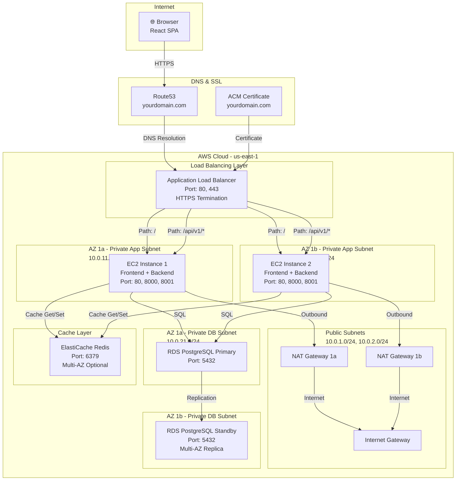
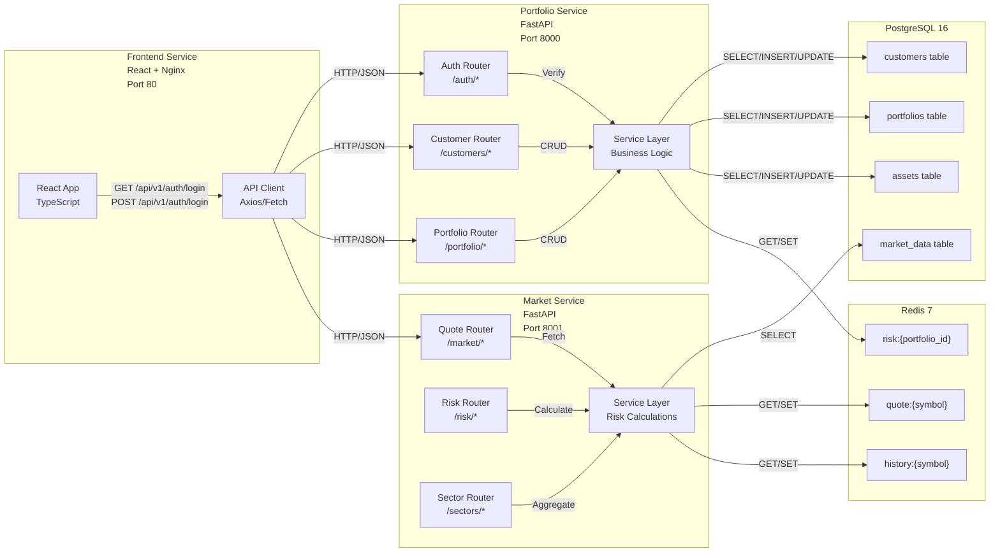
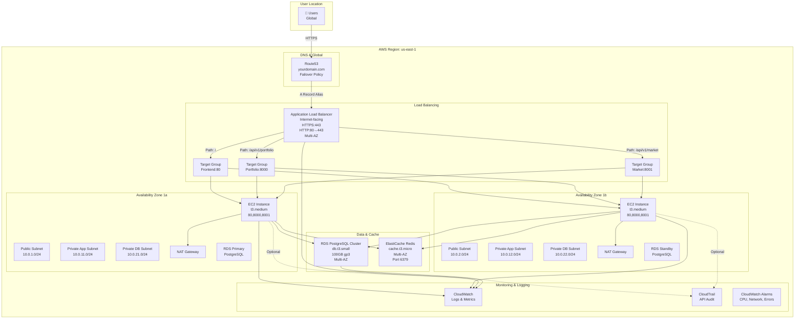
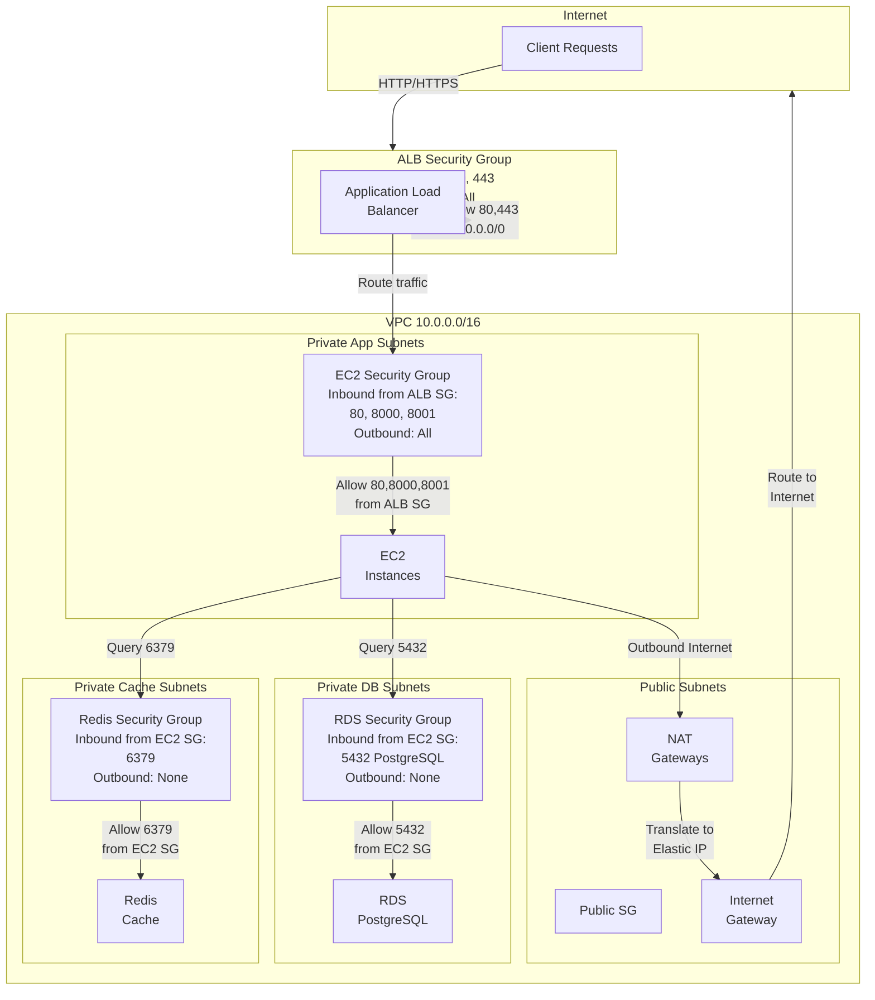
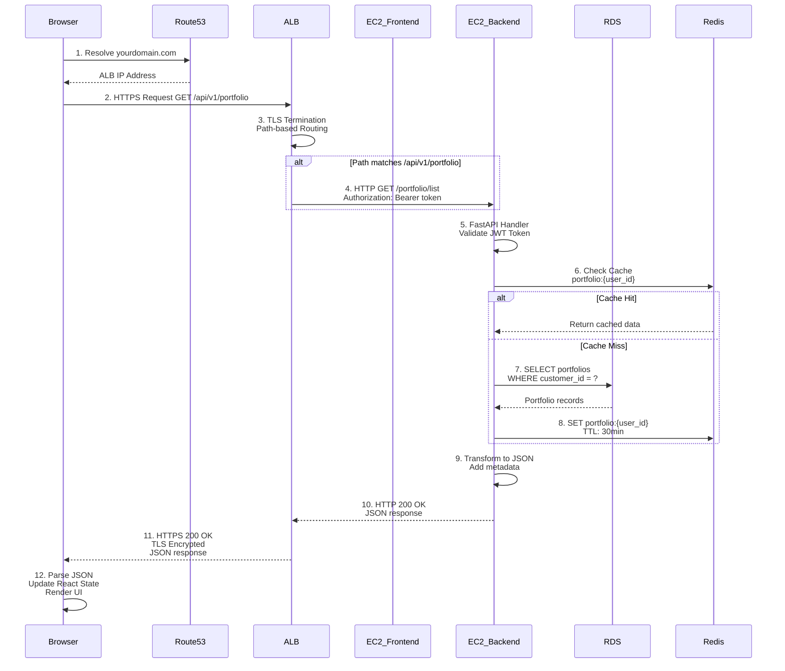
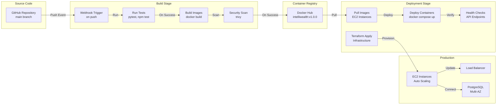

# Architecture Diagrams

**Mermaid Diagrams for IntelliWealth Architecture**

---

## System Architecture Diagram

---

## Microservice Communication Flow

---

## AWS Deployment Architecture

---

## Network Segmentation & Security Groups

---

## Request Flow Through System

---

## Security Architecture

```mermaid
graph TB
    subgraph Outside["External Threats"]
        DDoS["DDoS Attacks"]
        Malware["Malicious Requests"]
    end
    
    subgraph Layer1["Layer 1: Network Edge"]
        AWS_Shield["AWS Shield Standard<br/>DDoS Protection"]
        Route53_HC["Route53 Health Check<br/>Failover"]
    end
    
    subgraph Layer2["Layer 2: Load Balancer"]
        ALB_SG["ALB Security Group<br/>Whitelist Ports:<br/>80, 443"]
        ALB_WAF["WAF Rules<br/>SQL Injection<br/>XSS Prevention"]
        HTTPS["HTTPS/TLS 1.2+<br/>ACM Certificates<br/>Encryption"]
    end
    
    subgraph Layer3["Layer 3: Network"]
        EC2_SG["EC2 Security Group<br/>Only from ALB<br/>Ports 80,8000,8001"]
        VPC_Net["VPC Network<br/>Private Subnets<br/>No Public IP"]
        NAT["NAT Gateway<br/>Outbound Only"]
    end
    
    subgraph Layer4["Layer 4: Application"]
        Auth["JWT Authentication<br/>HS256 Signing<br/>24h Expiration"]
        Input_Val["Input Validation<br/>Pydantic Schemas<br/>Type Checking"]
        RateLimit["Rate Limiting<br/>Per User<br/>Per IP"]
    end
    
    subgraph Layer5["Layer 5: Data"]
        RDS_SG["RDS Security Group<br/>Only from EC2<br/>Port 5432"]
        RDS_Enc["RDS Encryption<br/>AWS KMS<br/>At Rest"]
        Backup["Backup Strategy<br/>30-day Retention<br/>Cross-AZ"]
    end
    
    subgraph Layer6["Layer 6: Monitoring"]
        CloudWatch["CloudWatch Monitoring<br/>Logs & Metrics"]
        Alarms["CloudWatch Alarms<br/>CPU, Errors,<br/>Anomalies"]
        Audit["CloudTrail Audit<br/>API Activity Log"]
    end
    
    Outside -->|Attack Vector| Layer1
    Layer1 -->|Block| Layer2
    Layer2 -->|Block| Layer3
    Layer3 -->|Block| Layer4
    Layer4 -->|Validate| Layer5
    Layer5 -->|Monitor| Layer6
```

---

## CI/CD Deployment Pipeline

---

**Last Updated**: May 2026  
**Diagrams Created**: System Architecture, Service Communication, AWS Deployment, Network Security, Request Flow, Security Layers, CI/CD Pipeline
